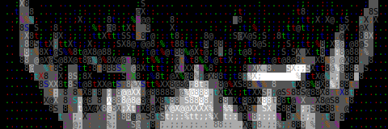

```
                                />_________________________________ 
                        [########[]_________________________________> 
                                \>                                    
 /$$$$$$$                                    /$$$$$$$                      /$$                
| $$__  $$                                  | $$__  $$                    | $$                
| $$  \ $$  /$$$$$$   /$$$$$$  /$$$$$$/$$$$ | $$  \ $$  /$$$$$$   /$$$$$$$| $$   /$$  /$$$$$$$
| $$$$$$$  /$$__  $$ /$$__  $$| $$_  $$_  $$| $$$$$$$  |____  $$ /$$_____/| $$  /$$/ /$$_____/
| $$__  $$| $$  \ $$| $$  \ $$| $$ \ $$ \ $$| $$__  $$  /$$$$$$$| $$      | $$$$$$/ |  $$$$$$ 
| $$  \ $$| $$  | $$| $$  | $$| $$ | $$ | $$| $$  \ $$ /$$__  $$| $$      | $$_  $$  \____  $$
| $$$$$$$/|  $$$$$$/|  $$$$$$/| $$ | $$ | $$| $$$$$$$/|  $$$$$$$|  $$$$$$$| $$ \  $$ /$$$$$$$/
|_______/  \______/  \______/ |__/ |__/ |__/|_______/  \_______/ \_______/|__/  \__/|_______/ 
                            
                          ___________________________________<\         
                        <_________________________________[ ]########] 
                                                          </         
```

<!--START_SECTION:waka-->
<!--END_SECTION:waka-->

<div>

<div id="badges" align="right">
  
  <p>Пиши, не стесняйся</p>
  <div>
  <a href="https://t.me/boombacks">
    
   </a>
   <a href="mailto:nikolaevforbuss@gmail.com">
    
    </a>
  </div>
 </div>
</div>


# Tools
### :godmode: <ins>Core</ins>:
[](https://skillicons.dev) </br>

### :pager: <ins>Main lifestyle hard'n'soft used</ins>:
[](https://skillicons.dev)

### 🛠️ <ins>Other</ins>: 
[](https://skillicons.dev)
</br>

### :fire: My Favorite languages :  

[](https://github.com/anuraghazra/github-readme-stats)


# Activities:
### :space_invader: Leetcode:


### :trophy: Achievements


### Contributions:
<picture>
  <source media="(prefers-color-scheme: dark)" srcset="https://raw.githubusercontent.com/1boombacks1/1boombacks1/output/github-snake-dark.svg" />
  <source media="(prefers-color-scheme: light)" srcset="https://raw.githubusercontent.com/1boombacks1/1boombacks1/output/github-snake.svg" />
  
</picture>